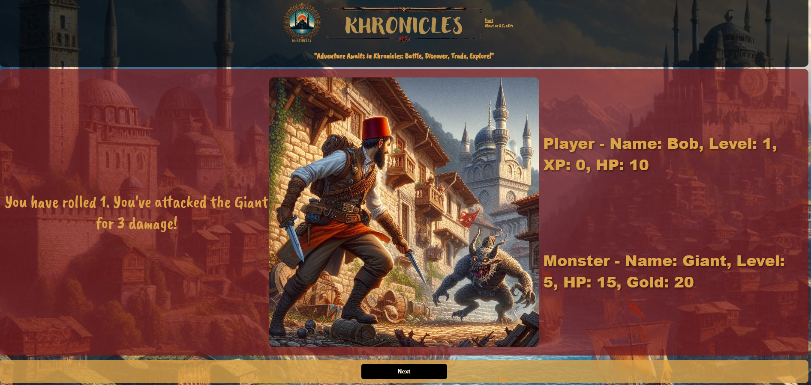

# Khronicles

**Khronicles** is an engaging RPG game set in the world of Ottoman times. Players embark on a thrilling adventure where they battle monsters, earn gold, gain experience points (XP), and level up. The game involves strategic decisions, resource management, and dynamic combat scenarios.

## Table of Contents

- [Tools Used](#tools-used)
- [How to Play](#how-to-play)
- [Gameplay Image](#gameplay-image)
- [Code Overview](#code-overview)
- [About Us](#about-us)

## Tools Used

### HTML
- **index.html**: Contains the structure of the game's user interface, including the layout for stats, controls, and messages.
- **aboutUs.html**: Provides information about the game, developers, and credits.

### CSS
- **styles.css**: Defines the styling of the game, including background images, layout, and design of buttons and text.

### JavaScript
- **app.js**: Contains the game logic, including functions for navigating locations, fighting monsters, and managing player stats and inventory.

## How to Play

1. **Start the Game**: Open the game in a web browser. You will start with a character named Bob and an initial encounter with a monster.
2. **Navigate the Game**: Use the buttons to attack the monster or run away.
   - **Attack**: Engage the monster in combat, rolling dice to determine attack success and damage.
   - **Run**: Attempt to flee from the battle, with a dice roll determining success.
3. **Manage Resources**: Keep an eye on your health points (HP), gold, and XP displayed at the top.
   - **HP**: Decreases when you take damage; can be critical to monitor during battles.
   - **Gold**: Earned by defeating monsters and used for various game actions.
   - **XP**: Increases as you defeat monsters and level up your character.
4. **Combat**:
   - **Player Turn**: Roll the dice to attack the monster, inflicting damage based on the roll and character level.
   - **Monster Turn**: The monster attacks back, reducing your HP.
5. **Victory or Defeat**: Defeat the monster to win gold and XP, or get defeated if your HP drops to zero.
6. **Restart**: After a game over, use the "Play Again" button to restart the game with initial stats.

## Gameplay Image

## Code Overview

### index.html

The HTML structure includes:
- **Header**: Navigation bar with logo and menu links.
- **Game Area**: Displays game text, dynamic images, character stats, and buttons for actions.
- **Footer**: Displays copyright information.

### aboutUs.html

Provides information about the game, the development team, and credits.

### styles.css

CSS styles include:
- **Body**: Background image and overall layout settings.
- **Navigation Bar**: Grid layout for logo and menu.
- **Game Area**: Grid layout for dynamic images, game text, and character stats.
- **Buttons**: Styled for user interaction with hover effects.

### app.js

Key JavaScript functions:
- **dice(min, max)**: Rolls a random number between the specified min and max values.
- **Character and Monster Classes**: Define the properties and methods for player characters and monsters.
- **renderImage(image)**: Displays an image in the game area.
- **renderButtons()**: Renders action buttons based on the game state.
- **renderGameText(text)**: Displays game narrative and instructions.
- **renderStats()**: Displays player and monster stats.
- **gameOver(isVictory)**: Handles the end game scenario, displaying victory or defeat messages.
- **resetGame()**: Resets the game to initial state.
- **run()**: Handles the player's attempt to flee from battle.
- **attack()**: Handles the player's attack on the monster, including dice rolls and damage calculation.
- **monsterPhase()**: Handles the monster's attack on the player.
- **renderNextButton(label, action)**: Displays a button for proceeding to the next game phase.
- **encounter()**: Initializes a new encounter with a monster, setting up the game state and UI.

## Domain Model ##
[Domain Model](/img/images/domain-model.png)

### About Khronicles

Khronicles is a captivating RPG game set in the enchanting world of Ottoman times. Players embark on epic adventures, engaging in battles, discovering secrets, and exploring a richly detailed world. Inspired by classic Dungeons & Dragons adventures, Khronicles offers a blend of storytelling and strategic gameplay.

### About BitCrafters

BitCrafters is the creative team behind Khronicles. With a passion for gaming and storytelling, BitCrafters is dedicated to delivering immersive and engaging gaming experiences. The team brings together expertise in game development and a love for innovation, crafting games that captivate and inspire players.

### Credits

Special thanks to:
- All BitCrafters Team Members
- Jacob for teaching the class
- CodeFellows for providing the opportunity to develop this game in a professional setting

Enjoy your adventure in Khronicles! Battle, discover, trade, and explore to become a legendary hero!

### Project Contributors: 
Ahmed Elnogoumi, Mak Trnka and Patrick Kawika Reveira